## General Search: Najir

You will land on the Najir search page that looks something like the following.   
The blue arrow is boxed in red in the below screenshot.  You can use the blue arrow to hide/show the left pane.

## 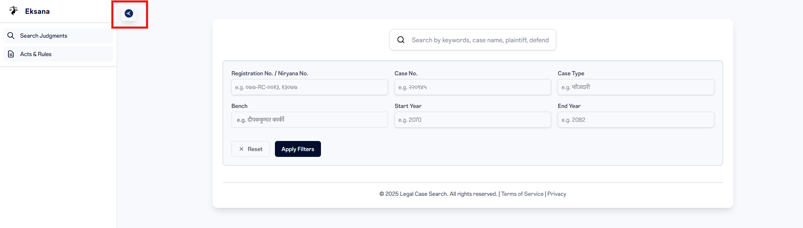

Here,  
The Search Bar expects keywords related to the najir. It can be any of the following  
\[{Content like "Parliament Dissolution", "Doctrine of Necessity" etc}, {Plaintiff/Defendant Name}, {Judge's Name}\]  
Please do not input questions in this field. For example “What is the Najir that includes procurement corruption?”. This is invalid. Instead type in “procurement corruption” in the keyword search bar.

### How to use the Advanced Filter that are present just below the search bar?

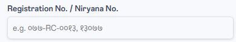

Registration No. of the Case or Nirnaya Number from Nepal Kanun Patrika(NKP)  
This only includes alphanumeric characters. Do not enter words like  "निर्णय नं. १३०७७", and just enter the number as " १३०७७" if you are using Nirnaya Number. It can also be in English, so you can also type in "13077" and it will give you the same result..  
If you are using Registration Number, you can type in  "०७७-RC-००१३" or "077-RC-0013". Both of them will give the same result.

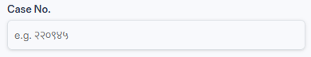  
Case No. is different from Nirnaya No. that is used by NKP.  
It is individual for each Najir that is available from the Supreme Court. We might disable this option in the future as this seems to be confused with Nirnaya No. used by NKP.

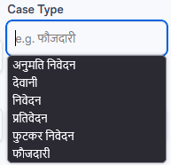

Double Click on the Case Type field to obtain different types of Cases. You can select one if you are certain on the case type you are searching and want to narrow your search.

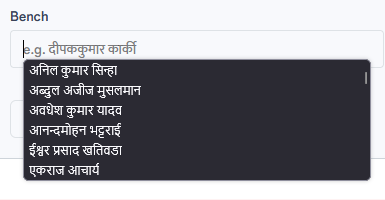

Double Click on the Bench field to obtain the Judge's name. You can select multiple judges using "," . If you use multiple Judge's names, the search will look for Najir that includes ALL the judges. It does not provide najirs with either one of the judges if you are entering multiple judges' names.

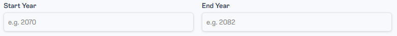

The start and the end year are also used to narrow down your search. The start year and the end year are filtered based on decision date and not registration date.

## General Search: Acts, Rules & Regulations

To search through Acts, Rules & Regulation, you will need to click the following button.  
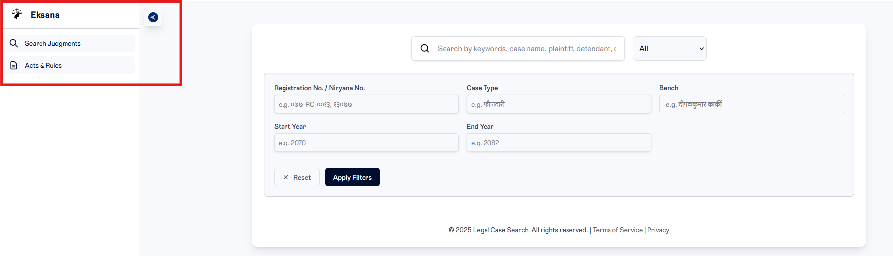  
The blue arrow expands and collapses the left lane. When you expand it, you can see the description that says “Acts and Rules”. You need to select it to be able to search through Acts, Rules & Regulations.  
Once you click it, you will see something like the following:  
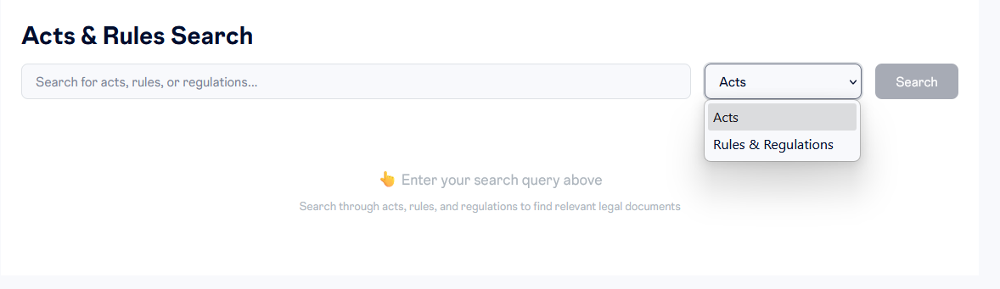  
There is a dropdown that allows you to choose what you are looking to search.  
Once you have selected what you are looking to search, you can type in keywords related to the Acts or Rules & Regulation, and it will give you the results based on the document that matches the keyword.  
Please do not input questions in this field.   
In the example below, we have entered “Supreme Court” and searched through the Rules & Regulations” database. The output is as follows:  
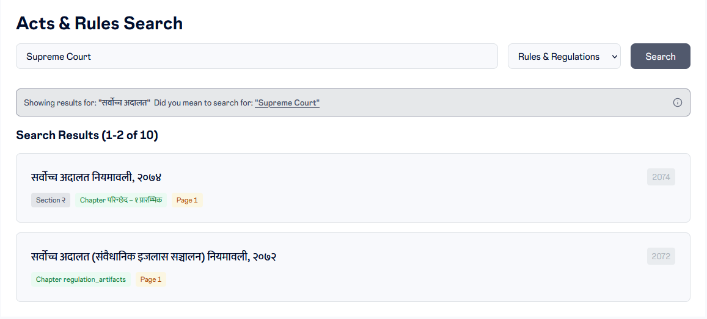  
Now, you can select the appropriate document you want to view. You should land in a page that looks something like the following:  
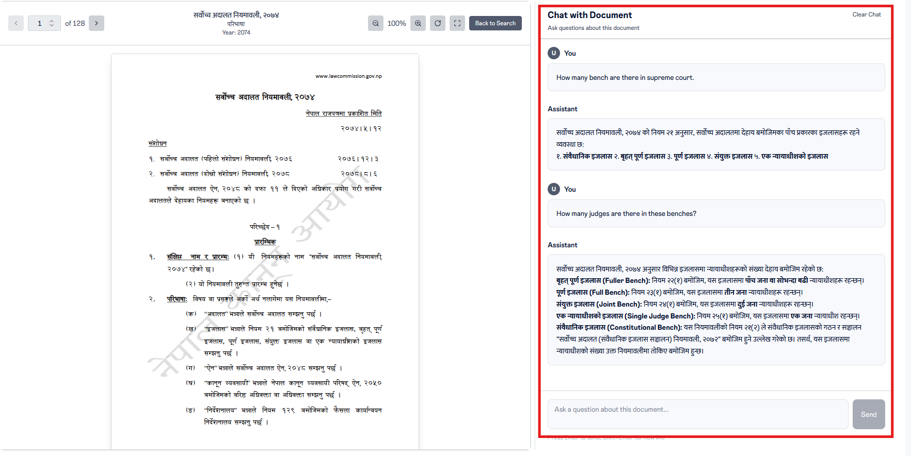  
On the document’s right side, an AI chat assistant is provided to you that you can use to ask any questions about the particular document. Refrain from asking questions outside of the document. In the screenshot shown, we asked two questions, and got the following responses:  
**You**  
How many bench are there in supreme court.  
**Assistant**

सर्वोच्च अदालत नियमावली, २०७४ को नियम २१ अनुसार, सर्वोच्च अदालतमा देहाय बमोजिमका पाँच प्रकारका इजलासहरू रहने व्यवस्था छ:

१. **संवैधानिक इजलास** २. **बृहत् पूर्ण इजलास** ३. **पूर्ण इजलास** ४. **संयुक्त इजलास** ५. **एक न्यायाधीशको इजलास**

**You**  
How many judges are there in these benches?  
**Assistant**

सर्वोच्च अदालत नियमावली, २०७४ अनुसार विभिन्न इजलासमा न्यायाधीशहरूको संख्या देहाय बमोजिम रहेको छ:

* **बृहत् पूर्ण इजलास (Fuller Bench):** नियम २२(१) बमोजिम, यस इजलासमा **पाँच जना वा सोभन्दा बढी** न्यायाधीशहरू रहन्छन्।  
* **पूर्ण इजलास (Full Bench):** नियम २३(१) बमोजिम, यस इजलासमा **तीन जना** न्यायाधीशहरू रहन्छन्।  
* **संयुक्त इजलास (Joint Bench):** नियम २४(१) बमोजिम, यस इजलासमा **दुई जना** न्यायाधीशहरू रहन्छन्।  
* **एक न्यायाधीशको इजलास (Single Judge Bench):** नियम २५(१) बमोजिम, यस इजलासमा **एक जना** न्यायाधीश रहन्छन्।  
* **संवैधानिक इजलास (Constitutional Bench):** यस नियमावलीको नियम २१(२) ले संवैधानिक इजलासको गठन र सञ्चालन "सर्वोच्च अदालत (संवैधानिक इजलास सञ्चालन) नियमावली, २०७२" बमोजिम हुने उल्लेख गरेको छ। तसर्थ, यस इजलासमा न्यायाधीशको संख्या उक्त नियमावलीमा तोकिए बमोजिम हुन्छ।

## Frequently Asked Questions

### 1\. When I load a najir, I get the following on the right side. It says the Summary is being generated. What does it mean?

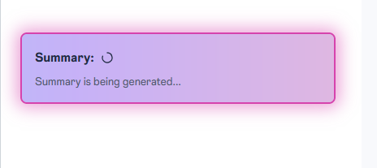

We have a database of 60k Najirs that includes all the digitized najirs from Supreme Court and NKP. For some of the Najirs, summary has not been extracted so when you click them, you see the Najir and can read it, but on the right side all the Case Brief is being extracted for the first time. It is completely normal and unfortunately takes about 2 minutes. Once it is loaded, you will not face the same issue again for the same Najir.

### 2\. I only know the Nirnaya Number of a case. How do I look for that particular najir?

In that case, leave the search field blank, and use the nirnaya number in the Registration/Nirnaya No. field and hit Apply Filters. Shown Below: 

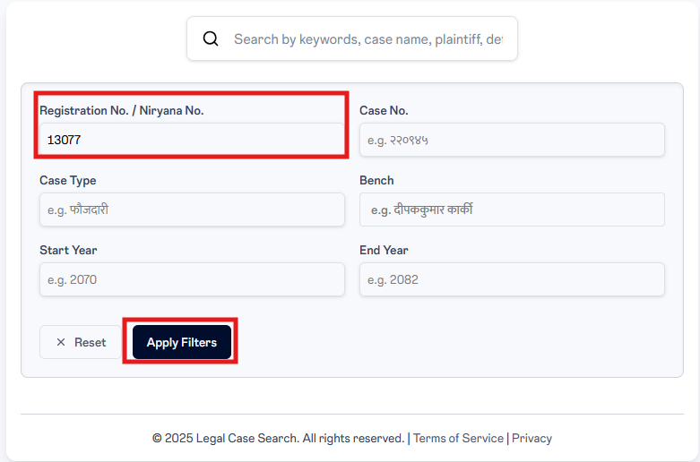

### 3\. How do I look for the Act or Rules & Regulation and the Najir side by side

This particular feature is only available when you are viewing a particular Najir. When a Najir is loaded, the right side of the webpage contains “Case Brief” as shown below:  
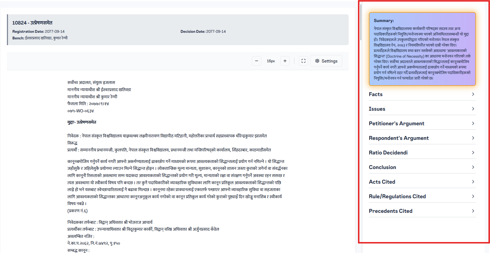  
Expand on the “Acts Cited”, and select the attachment icon. If you select the Act, the section of the Najir where the Act is mentioned gets highlighted. If you select the attachment icon, the Act loads with the particular section . You will be able to see something like the following:  
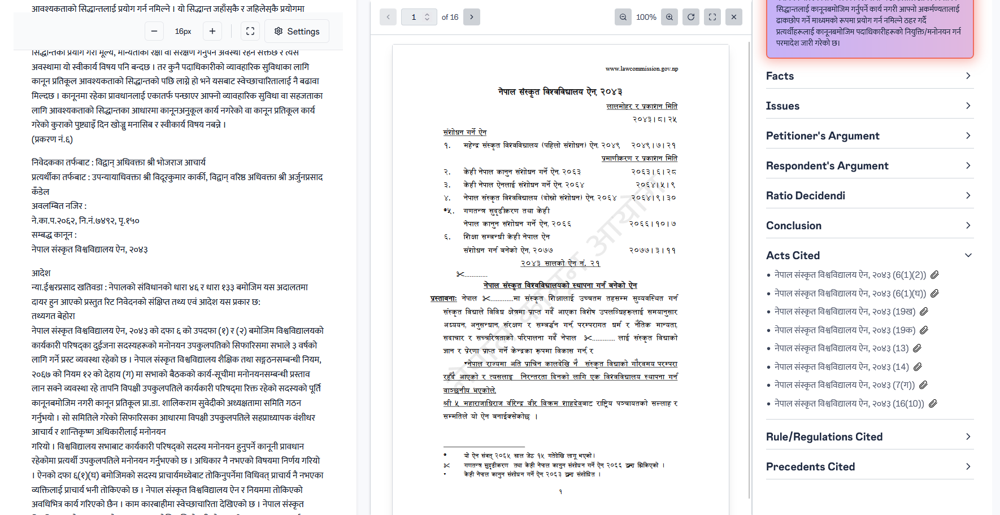

This is also applicable for Rules/Regulations Cited. If we do not have the act or rules & regulation that was cited, then you will not see the attachment icon. 

